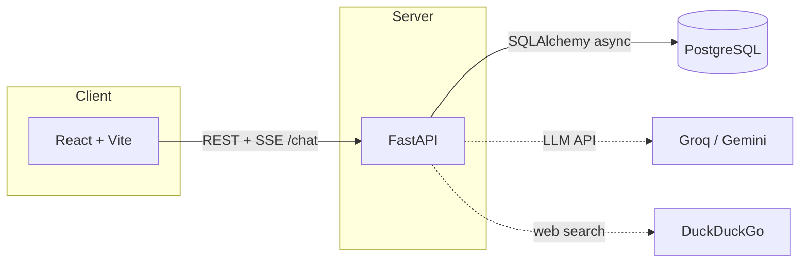

# Mouse Mentor

**Mouse Mentor** is a full-stack web app that helps guests plan Walt Disney World trips through a guided questionnaire and an AI chat assistant. Trip context (dates, party size, priorities, pace, and more) travels with every message so replies stay personalized; optional accounts let travelers save their trip and chat history to the cloud and pick up on another device. The stack is a React + Vite SPA talking to a FastAPI backend with JWT auth, streaming chat (SSE), and PostgreSQL in production—powered by Groq or Google Gemini plus DuckDuckGo-backed web search for up-to-date park and planning context.

Developed by Sydney Edwards · Repository: [`sydneye434/mouse-mentor`](https://github.com/sydneye434/mouse-mentor)

[](https://react.dev/)
[](https://vitejs.dev/)
[](https://fastapi.tiangolo.com/)
[](https://www.python.org/)
[](https://www.postgresql.org/)
[](https://github.com/sydneye434/mouse-mentor/actions/workflows/ci.yml)
[-brightgreen?style=flat-square)](https://github.com/sydneye434/mouse-mentor/actions/workflows/ci.yml)

## Live demo

**[Live demo →](https://your-app.vercel.app)** *(placeholder—replace with your deployed frontend URL after deploy.)*

## Architecture

The browser talks only to **FastAPI**; the API persists accounts and saved trips in **PostgreSQL** (or locally via SQLite). **Groq** or **Gemini** handles generation; **DuckDuckGo** supplies optional web search snippets—both are outbound integrations, not user-facing services.



<details>
<summary><strong>ASCII diagram (plain text)</strong></summary>

```
  +----------------+       HTTP (REST, SSE)        +------------------+
  |  React + Vite  |  ---------------------------> |     FastAPI      |
  |    (browser)   |                               |   (JWT, chat)    |
  +----------------+                               +--------+---------+
                                                            |
                                                            | async SQL
                                                            v
                                                    +----------+
                                                    | PostgreSQL |
                                                    +----------+

  FastAPI  ----optional---->  Groq / Gemini (LLM)
  FastAPI  ----optional---->  DuckDuckGo (web search)
```

</details>

---

## Prerequisites

- **Node.js** — [nodejs.org](https://nodejs.org)
- **Python 3.10+** (3.11 recommended; CI uses 3.11) — [python.org](https://www.python.org)

## Running the application locally

Run **two processes**: the API (`backend/`) and the Vite dev server (repo root). Use two terminals, or `npm run dev:all` on macOS/Linux.

### 1. Backend (FastAPI)

```bash
cd backend
python -m venv .venv
```

<details>
<summary><strong>Activate the virtual environment (Windows vs macOS/Linux)</strong></summary>

- **macOS / Linux:** `source .venv/bin/activate`
- **Windows (Command Prompt):** `.venv\Scripts\activate.bat`
- **Windows (PowerShell):** `.venv\Scripts\Activate.ps1`

</details>

```bash
pip install -r requirements.txt
uvicorn main:app --reload --port 8000
```

Leave this running. You should see: `Uvicorn running on http://127.0.0.1:8000`.

### 2. Frontend (React / Vite)

In a **second** terminal from the **project root** (not inside `backend/`):

```bash
npm install
npm run dev
```

Open **http://localhost:5173**. Vite proxies API routes to the backend in dev.

**One command (macOS/Linux):** from the project root, `npm run dev:all` starts backend + frontend with auto-reload. On Windows, use two terminals as above.

### Optional: custom API URL

Create `.env` in the project root:

```env
VITE_API_URL=http://localhost:8000
```

If unset in dev, the app uses relative URLs and Vite proxies `/auth`, `/chat`, `/health`, `/public`, etc. to `http://localhost:8000`.  
**Note:** `GET/DELETE /trip` and `POST /trip/share` are proxied to the API; paths like `/trip/<share-token>` are **not** proxied so the SPA can render the public shared trip page.

| What               | URL                     |
| ------------------ | ----------------------- |
| **App**            | http://localhost:5173   |
| **Backend**        | http://localhost:8000   |
| **API docs**       | http://localhost:8000/docs |

If the backend is off, chat and auth will fail until it’s running.

---

## Backend AI (chat)

The `/chat` endpoint streams replies (SSE) using:

- **Trip info** from the client for personalization.
- **Web search** — DuckDuckGo snippets for public, time-sensitive info.
- **Groq** (default) or **Google Gemini** — set `AI_PROVIDER` and the matching API key in `backend/.env` (see `backend/.env.example`).

**Groq (default):** get a key at [console.groq.com](https://console.groq.com), then:

```bash
AI_PROVIDER=groq
GROQ_API_KEY=your-groq-key-here
```

**Gemini:** get a key at [aistudio.google.com](https://aistudio.google.com), then:

```bash
AI_PROVIDER=gemini
GEMINI_API_KEY=your-gemini-key-here
```

Optional: `GROQ_MODEL`, `GEMINI_MODEL`. Restart the backend after changes.

---

## Frontend scripts

| Script | Description |
| ------ | ----------- |
| `npm run dev` | Vite dev server (HMR) |
| `npm run dev:all` | Backend + frontend (macOS/Linux) |
| `npm run build` | Production build |
| `npm run preview` | Preview production build locally |

---

## Backend API (summary)

- **GET** `/health` — health check  
- **POST** `/auth/register` — `{ "email", "password" }` (password ≥ 8 chars) → JWT + email  
- **POST** `/auth/login` — same body → JWT  
- **GET** `/trip` — saved trip (Bearer token required)  
- **DELETE** `/trip` — delete saved trip + messages (Bearer)  
- **POST** `/trip/share` — returns `{ "share_token" }` for a read-only link (Bearer; saved trip required)  
- **GET** `/public/trip/{share_token}` — trip JSON + `generated_itinerary` (no auth; 404 if invalid)  
- **POST** `/tips/generate` — `{ trip_info, regenerate? }` → `{ generation_id, tips[] }` (Bearer); caches until `regenerate: true`  
- **POST** `/chat` — messages + optional `trip_info`, `save_trip`; streams SSE tokens  

`save_trip: true` requires a valid Bearer token. Rate limits apply to `/chat` (see `backend/.env.example` / `RATELIMIT_ENABLED`).

Local development uses **SQLite** (`backend/local.db`) when `DATABASE_URL` is unset. Production uses **PostgreSQL** with async SQLAlchemy.

---

## CI pipeline and quality checks

GitHub Actions runs on push/PR to `main` / `master`:

- **Formatting:** Prettier (frontend), Black (backend)  
- **Linting:** ESLint, Ruff  
- **Tests:** Vitest + coverage (frontend), pytest + coverage ≥ 50% (backend)  
- **Security:** `npm audit`, Bandit, pip-audit (some steps may be non-blocking)

Run locally:

**Frontend (repo root):**

```bash
npm ci
npm run format:check
npm run lint
npm run test:coverage
```

**Backend (`backend/` with venv active):**

```bash
pip install -r requirements.txt -r requirements-dev.txt
black --check .
ruff check .
pytest --cov=. --cov-report=term-missing --cov-fail-under=50
bandit -r . -x ./tests
pip-audit -r requirements.txt
```

---

## Deployment (Vercel + Render)

**Frontend (Vercel)** — connect the repo; build `npm run build`, output `dist` (see `vercel.json`). Set **`VITE_API_URL`** to your Render API URL (no trailing slash).

**Backend (Render)** — root directory `backend/`; start `uvicorn main:app --host 0.0.0.0 --port $PORT`. Add **PostgreSQL**; set **`DATABASE_URL`**, **`JWT_SECRET_KEY`**, **`CORS_ORIGINS`**, and AI keys per `backend/.env.example`. Use **`render.yaml`** as a Blueprint if you prefer.

| Environment | Reference file |
| ----------- | -------------- |
| Frontend | `.env.example` (root) — `VITE_API_URL` |
| Backend | `backend/.env.example` |

---

## Pre-commit hook

Install [pre-commit](https://pre-commit.com/) and run `pre-commit install` from the repo root. Commits run Prettier/ESLint on staged frontend files and Black/Ruff on staged Python under `backend/`. Use `pre-commit run --all-files` to check the whole tree.

---

## First-time user flow (optional)

1. Open **http://localhost:5173** and use **Sign in** / **Register** if you want saved data.  
2. Complete or skip the **get-to-know-you** questionnaire (destination, dates, party, priorities, etc.).  
3. On the last step, choose whether to **save your trip** (requires sign-in).  
4. Chat with the assistant; signed-in users with saving enabled can **delete saved data** from the chat page.

---

## License / author

Project author: **Sydney Edwards** · GitHub: [@sydneye434](https://github.com/sydneye434)
